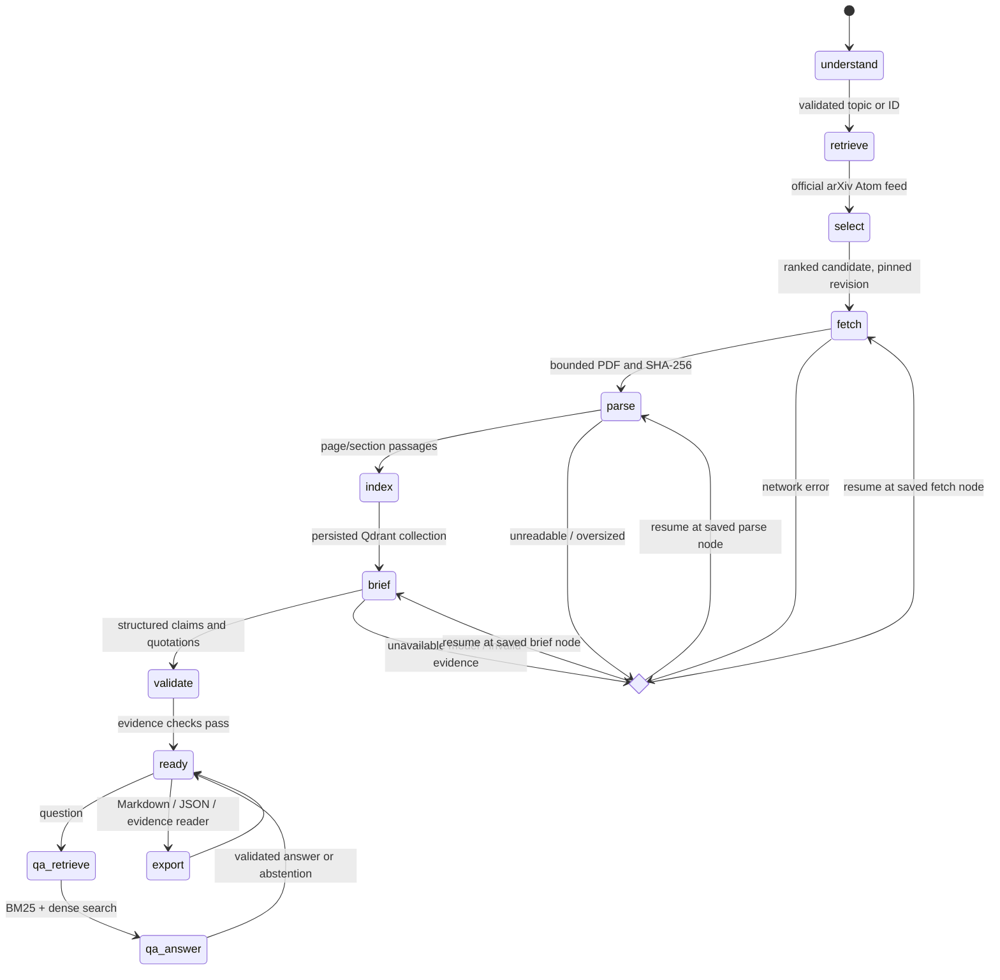

# Architecture and state

PaperTrail is a single-user Python application. The CLI and local browser frontend are thin adapters around the same domain agent; retrieval, source access, generation, persistence and rendering are separate modules. Ollama runs the default `qwen3.5:4b` model locally. No hosted database, paid API key, orchestration service, or frontend build is required.



The diagram shows representative failures; **every pipeline node** is checkpointed and can enter a failed state. `EDGES` in `graph.py` is the executable transition map, not a diagram drawn around a monolithic prompt. Successful nodes advance the checkpoint. Failed or interrupted nodes are re-entered on resume. There is no unbounded autonomous tool loop.

## Shared state

`RunState` is a Pydantic record with a schema version, session ID, original query, interpreted intent, ranked candidates, selected metadata, model names, PDF checksum, page/chunk counts, collection reference, briefing evidence IDs, structured briefing, QA history, warnings, event timings and the next node to execute. The LLM cannot change paper metadata, call arbitrary tools, choose URLs or execute code.

SQLite stores this state atomically after each successful transition and on a handled failure. The original PDF and parsed passages are separate artifacts, referenced by the run directory. Qdrant stores the embedding vectors with passage payloads. Conversation history and passage IDs survive process restarts; no in-memory chat session is required.

`web.py` serves a local HTML/JavaScript frontend and JSON endpoints through Python's HTTP server. `papertrail web` binds only to `127.0.0.1`, normally on port `8765`. The browser starts digest, question, or resume operations and polls actual stages and elapsed time. Each operation runs in an isolated worker through the existing `Agent`; the server permits one active job and uses the same data-directory lock as the CLI. A parent watchdog enforces `PAPERTRAIL_OPERATION_TIMEOUT` (240 seconds by default), stops an expired worker, and releases the operation slot after cleanup. Model loading, generation, and evidence review have separate timing events.

Web job IDs, progress, and recent job records exist only in server memory. They disappear on restart and are not durable queue entries. The underlying pipeline checkpoints and completed QA exchanges remain in SQLite. Page refresh reconnects to active work. After a server restart, incomplete digests can resume from saved checkpoints in the browser or CLI; unfinished questions can be retried. A web job being accepted does not mean its answer has been saved. The local frontend requires the server and Ollama; public GitHub Pages hosts static saved reports and provides no public inference or live QA service.

```text
.papertrail/
├── sessions.sqlite3          # durable graph checkpoints and QA history
├── writer.lock               # exclusive single-user operation
├── arxiv-cache/               # 24-hour metadata cache; verified revision-specific PDF cache
├── models/                   # downloaded CPU embedding model
├── vectors/                  # persistent Qdrant local collections
└── runs/<session>/
    ├── paper.pdf             # original source, never committed
    ├── parsed.json           # page/section text and offsets
    └── export/               # Markdown, JSON and portable HTML evidence reader
```

## Retrieval and provenance

1. Topic queries are reduced to bounded literal keywords, sent to the official arXiv API, then reranked using abstract embeddings and title-weighted BM25. Recent/latest queries use the API's submission-date sort. One paper is selected, and the whole candidate list remains inspectable. This is a bounded candidate search, not an exhaustive literature review.
2. PDFs are parsed page by page. Parser version 4 uses repeated central gutters to read common two-column layouts, preserves spanning title blocks, and excludes rotated margin stamps. Numbered headings, abstract and references are retained. Chunks contain 180 words with 30-word overlap, never cross pages, and carry stable IDs, section names and character offsets within section text.
3. FastEmbed runs BGE-small English embeddings on CPU. Qdrant collections are identified by PDF content hash, embedding name and parser/chunking version. Lexical retrieval uses BM25 with question stop words, simple plural normalization, and hyphen-compound aliases; these affect search only, not source quotations. Reciprocal-rank fusion combines the two rankings without treating incompatible scores as probabilities.
4. Briefing retrieval covers abstract, problem, method, results and limitations. QA retrieves up to seven diverse passages. References are excluded unless the user explicitly asks about citations/references. Referential follow-ups append the previous question for retrieval; previous generated answers are never used as source evidence.
5. Ollama returns JSON constrained to the Pydantic schema. The model first selects short evidence sentence IDs and then writes its claim; Python resolves those IDs and copies quotations directly from the source. Numeric values in the prose must occur in its quotation(s), including values attached to units such as `22meV`. Leading-dot decimals are normalized; this check does not verify unit equivalence. A second pass through the same model reviews claims against only their attached quotes, in batches of three. This is fallible semantic screening, not a proof of correctness. Invalid outputs get one bounded repair attempt that includes the rejected draft and the reason.
6. For briefing paraphrases rejected by semantic review, Python can copy the first one or two cited source excerpts in their place. Each replacement begins **“Source wording (automatic review requested inspection)”**, preserves its evidence IDs, undergoes provenance validation, and produces a session warning. This fallback presents inspectable source text rather than asserting that review succeeded. Rejected limitations are removed instead of retained as excerpts; an empty limitations list receives an explicit missing-evidence note. Unrepaired schema or provenance errors still fail the briefing. QA has no extractive fallback: a draft that fails evidence or support checks becomes an explicit evidence-validation abstention.

## Recovery and boundaries

- arXiv requests are serialized with at least three seconds between starts in one data directory. Metadata retries transient errors at most three times; downloads are capped at 30 MB and written atomically.
- A topic request receiving HTTP 406 can make one equivalent canonical request: alphanumeric terms need no phrase quotes, hyphenated terms retain their quotes, all terms and Boolean operators remain intact, and recent-query sorting is preserved. The API's default ten results are trimmed locally when fewer were requested. Success adds a warning; repeated 406 responses remain errors.
- Only normalized arXiv IDs generate PDF destinations. Redirects are not followed. XML entity expansion is disabled. Source text is delimited data in the model prompt, never an instruction to the agent.
- PDFs over 100 pages or with too little readable text fail explicitly. There is no silent partial-paper summary and no speculative OCR result.
- Index upserts are idempotent; a resumed partial build uses the same point IDs. Model changes cannot silently reuse a session's incompatible index/configuration.
- A data-directory lock serializes writes and local Qdrant access. This is intentionally a local, single-user application, not a multi-user service.

Successful API metadata is cached for 24 hours; failed responses are not cached. A successful equivalent canonical response is also stored under the original parameters, avoiding another known-rejected request on subsequent runs. PDFs are shared across sessions only for explicit revisions, after checking the stored source URL, ID, size, signature, and SHA-256. This transport normalization does not make every topic available. In the live diagnostic, natural-language `research about electron` succeeded via `https://export.arxiv.org/api/query?search_query=all:electron` after the parameterized request returned HTTP 406; the multi-keyword attention/translation query remained blocked upstream under equivalent encodings.

Model calls use a 32,768-token context and reject requests above a conservative 28,000-byte input budget (including any repair conversation), reserving space for output and chat framing. This byte bound is designed for the default Qwen byte-BPE tokenizer; alternative models must support the same context/tokenization assumptions. Inputs are never silently clipped by the application.

## Known limits

Exact quotations establish **provenance, not entailment**. A model can misinterpret a true quotation, and the same-model reviewer can accept an error or reject a valid paraphrase. Fallback excerpts need human inspection: they can omit surrounding context or fit their briefing heading poorly. Numeric checks do not verify units, scientific validity or experimental comparability. Chunking and section detection are heuristic; equations, spanning tables, figure labels and non-English documents may extract imperfectly. Retrieval can miss evidence, so abstention means insufficient *retrieved* evidence, not proof of absence from the paper. A small local model and a small evaluation set cannot establish universal reliability.
